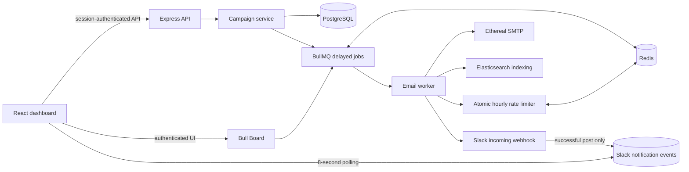
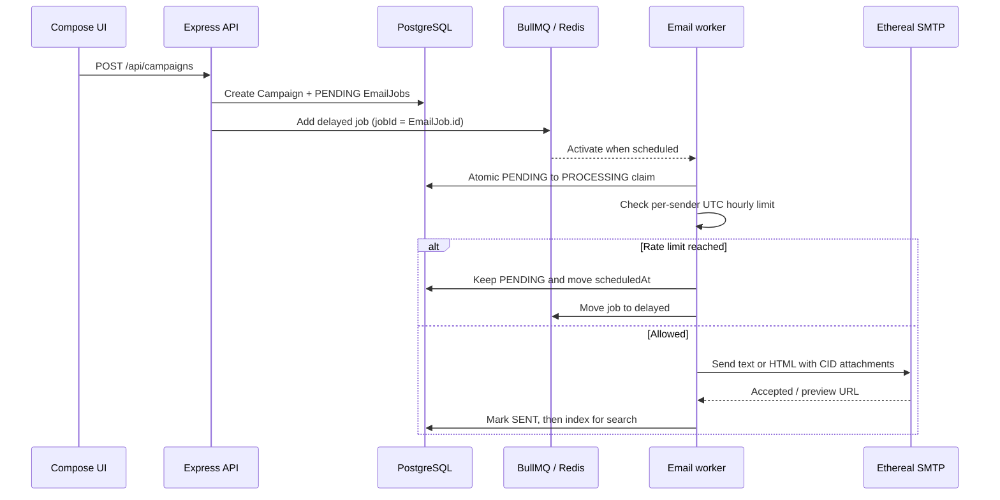

# Dispatch

Dispatch is a small email scheduler I built for the ReachInbox hiring assignment. You write an email, add a list of recipients, pick a start time, a delay and an hourly limit, and it sends them on schedule through a fake SMTP server (Ethereal). It keeps its schedule across server restarts, and it is built so the same email is not queued or sent twice.

Scheduling is done with BullMQ delayed jobs stored in Redis. There are no cron jobs anywhere in the project.

## What it is built with

| Part | Tools |
| --- | --- |
| API and worker | Node.js, Express, TypeScript |
| Queue | BullMQ on Redis |
| Database | PostgreSQL with Prisma |
| Email | Nodemailer with Ethereal (fake SMTP) |
| Search | Elasticsearch 8 |
| Frontend | React, Vite, TypeScript, Tailwind CSS, TipTap editor |
| Login | Google OAuth (real, no mock) |
| Alerts | Slack OAuth with an incoming webhook |

## Screenshots

### Login and dashboard

**1. Google sign-in page**


**2. Scheduled emails list**
Shows pending emails with scheduled time and status.


**3. Sent and failed emails list**
Shows sent emails and a failed one with its status badge.


### Composing a campaign

**4. Compose screen**
Editor toolbar, subject, recipients, send time, delay and hourly limit.


**5. Schedule summary and rate-limit warning**
The summary line and the amber note when recipients exceed the hourly limit.


### Queue, sending and persistence

**6. Bull Board with delayed jobs**
Live queue view showing the scheduled jobs waiting in Redis.


**7. Restart test: server stopped and started again**
Terminal showing the backend stopped, restarted, and the reconciliation log lines.


**8. Ethereal inbox with the received emails**
Each address received exactly once after the restart.


**9. Rate limit in action**
Scheduled list after the limit was hit: sent emails moved to Sent, the rest moved to the next hour.


### Slack alerts

**10. Slack connected state**
Sidebar with the Slack logo, connected status and workspace name.


**11. Slack message in the channel**
The alert posted to Slack when a sender hit its hourly limit.


**12. In-app Slack notification toast**
The toast shown in the dashboard after Slack accepted the message.


### Search and health

**13. Email search results**
Results from Elasticsearch for a recipient or subject.


**14. All services running**
Output of `docker compose ps` plus the `/health` response.


## How it works



### Scheduling

1. The compose form calls `POST /api/campaigns`.
2. The API saves a campaign and one `EmailJob` row per recipient in PostgreSQL, all `PENDING`. Each row gets a `scheduledAt` time, spaced by the delay you chose.
3. For every row it adds a BullMQ delayed job whose job ID is the row's own ID. Adding the same email twice cannot create two jobs.
4. When a job is due, the worker claims the row with a conditional update (`PENDING` to `PROCESSING`). Only one worker can win that update.
5. The worker checks the sender's hourly limit. If there is room, it sends the email and marks the row `SENT`. Otherwise it defers the job (see below).
6. The result is indexed into Elasticsearch so it can be searched from the dashboard.



### What happens when the server restarts

- Delayed jobs live in Redis, and Redis data sits in a Docker volume, so scheduled emails are still there after a restart.
- PostgreSQL is the source of truth for status. On startup, `reconcilePendingJobs` looks for `PENDING` rows that have no BullMQ job (for example, a crash between saving to the database and adding to the queue) and adds the missing jobs.
- Rows that are already `SENT` or `FAILED` are skipped, so nothing restarts from scratch.
- If a send fails for a temporary reason, the row goes back to `PENDING` and BullMQ retries it (3 attempts by default). Only the last failed attempt marks the row `FAILED`.

### Delay, rate limit and concurrency

- Delay between emails: set per campaign, in seconds. The compose form defaults to 5 seconds. Each recipient's `scheduledAt` is spaced by that amount.
- Hourly limit: a Redis counter per sender and UTC hour, updated by an atomic Lua script, so it is safe with several workers or instances. The limit itself comes from the compose form, not from a hardcoded value.
- When the limit is reached, the job is not dropped or failed. Its row stays `PENDING`, `scheduledAt` moves into the next hour window, and the BullMQ job is moved to delayed. A helper keeps the campaign's order and spacing when that happens.
- Concurrency: `EMAIL_WORKER_CONCURRENCY` sets how many jobs run in parallel (default 5). Running in parallel is safe because every status change is a conditional update in PostgreSQL.

### When 1000+ emails are due at once

All of them are just delayed jobs sitting in Redis. Only `EMAIL_WORKER_CONCURRENCY` of them run at any moment. Once a sender reaches its hourly limit, the remaining jobs are pushed into the next hour in order. None of them fail, and Slack is notified once per sender per hour.

### Slack alerts

When a sender hits its hourly limit for the first time in a given hour, the worker posts a message to the user's Slack channel, if they connected one. A Redis key stops repeat posts in the same hour. The dashboard then shows a toast (with optional sound) only after Slack has accepted the webhook call. If Slack isn't connected, nothing is sent and nothing breaks. If the user connects Slack later, alerts start working without a redeploy.

## Features

| Area | What is implemented |
| --- | --- |
| Backend: scheduler | Campaign creation, BullMQ delayed jobs, stable job IDs, worker processing, configurable concurrency |
| Backend: persistence | PostgreSQL campaigns and email jobs, startup reconciliation, Redis-backed BullMQ and session store |
| Backend: rate limiting | Atomic per-sender UTC-hour counters in Redis, deferred scheduling, Slack alert on first limit hit |
| Backend: email | Ethereal SMTP, plain-text fallback, HTML mail, inline images as CID attachments, preview URLs in the logs |
| Backend: search and operations | Elasticsearch indexing and search, authenticated Bull Board, Google and Slack OAuth |
| Frontend: account | Google login and logout, user name, email and avatar, Slack connect and disconnect |
| Frontend: compose | Recipient chips, CSV or TXT upload with a detected-recipient count, rich-text editor with images, start time, delay, hourly limit |
| Frontend: dashboard | Scheduled, sent and failed email lists with loading and empty states, search |
| Frontend: notifications | Slack alert toast with optional sound and a link to the Slack channel when available |

## Getting started

You need:

- Node.js 20.19+ (or a current 22.x) and npm
- Docker with the Compose plugin
- Google OAuth client credentials
- An Ethereal SMTP account
- A Slack app (optional, only for alerts)

### 1. Start PostgreSQL, Redis and Elasticsearch

From the repository root:

```bash
docker compose up -d
```

This exposes PostgreSQL on 5432, Redis on 6379 and Elasticsearch on 9200. If you change the database credentials in `docker-compose.yml`, update `DATABASE_URL` in the backend environment to match.

### 2. Run the backend

Copy `backend/.env.example` to `backend/.env`, fill it in, then:

```bash
cd backend
npm install
npx prisma generate
npx prisma migrate deploy
npm run dev
```

The API starts on `http://localhost:4000` and the BullMQ worker starts in the same process. Handy URLs:

- Health check: `http://localhost:4000/health`
- Bull Board (live queue view, login required): `http://localhost:4000/admin/queues/`

Checks you can run: `npm run typecheck`, `npm run build`, `npx prisma validate`.

### 3. Run the frontend

Copy `frontend/.env.example` to `frontend/.env`, then:

```bash
cd frontend
npm install
npm run dev
```

Open `http://localhost:5173`. In development, Vite proxies `/api`, `/auth` and `/admin` to the backend, so you normally don't need to set an API URL.

### Environment variables (backend)

| Variable | What it is |
| --- | --- |
| `PORT` | API port (default 4000) |
| `DATABASE_URL` | PostgreSQL connection string |
| `REDIS_URL` | Redis connection string |
| `ELASTICSEARCH_URL` | Elasticsearch address |
| `EMAIL_WORKER_CONCURRENCY` | Jobs the worker runs in parallel (default 5) |
| `ETHEREAL_HOST`, `ETHEREAL_PORT`, `ETHEREAL_USER`, `ETHEREAL_PASSWORD` | Ethereal SMTP login |
| `FRONTEND_ORIGIN` | Allowed browser origin for CORS (for local dev, `http://localhost:5173`) |
| `GOOGLE_CLIENT_ID`, `GOOGLE_CLIENT_SECRET`, `GOOGLE_CALLBACK_URL` | Google OAuth |
| `SESSION_SECRET` | Long random string used to sign sessions |
| `SLACK_CLIENT_ID`, `SLACK_CLIENT_SECRET`, `SLACK_CALLBACK_URL` | Slack OAuth (optional) |
| `NODE_ENV`, `TRUST_PROXY` | Set `NODE_ENV=production` for HTTPS-only cookies, and `TRUST_PROXY=1` behind a proxy |

The frontend only needs `VITE_BACKEND_ORIGIN`, which is used for the login and Slack redirects. Never put server secrets in `frontend/.env`.

## Setting up the outside services

### Google login

1. In [Google Cloud Console](https://console.cloud.google.com/apis/credentials), create an OAuth client of type Web application.
2. Authorized JavaScript origin: `http://localhost:5173`
3. Authorized redirect URI: `http://localhost:4000/auth/google/callback`
4. Put the client ID and secret, plus the callback URL, in `backend/.env`, and set a long random `SESSION_SECRET`.

Sessions use an HTTP-only, `SameSite=Lax` cookie.

### Ethereal (fake SMTP)

1. Create a test mailbox at [ethereal.email](https://ethereal.email).
2. Copy its host, port, username and password into the four `ETHEREAL_*` variables.
3. Restart the backend after changing them. The saved sender is refreshed from these values when you schedule a campaign.

Ethereal only captures mail. Nothing reaches real recipients. The worker logs a preview URL for every message it sends.

Images in the editor are stored in the campaign body as data URLs (2 MB total per email, PNG, JPEG, GIF or WebP) and converted to CID attachments when the email is sent. No image hosting is used.

### Slack (optional)

1. Create an app at [api.slack.com/apps](https://api.slack.com/apps).
2. Turn on Incoming Webhooks and make sure the `incoming-webhook` scope is set.
3. Add the redirect URL `http://localhost:4000/auth/slack/callback`.
4. Put the client ID, secret and callback URL in `backend/.env`.
5. Sign in, click Connect Slack, and pick a channel. You can disconnect and reconnect from the sidebar.

The channel link in the toast only works if the connection stored the Slack team and channel IDs. If you connected before that was added, disconnect and connect again.

## Try it yourself

Restart test:

1. Schedule 3 or 4 emails to start 2 or 3 minutes from now, with a delay of about 10 seconds.
2. Stop the backend with Ctrl+C before the start time. Wait a bit, then start it again.
3. When the start time passes, the emails move from Scheduled to Sent, and each address shows up exactly once in your Ethereal inbox.

Rate limit test:

1. Schedule 8 emails starting now, with an hourly limit of 3.
2. The first 3 are sent. You should get a Slack message and a toast in the dashboard.
3. The other 5 stay in Scheduled, now with a time in the next UTC hour.

## Deploying a free preview to Render

The repo has a `render.yaml` Blueprint for a static frontend, a Node web service (Express plus the worker), a free PostgreSQL database and a free Key Value (Redis) instance. Treat this as a preview of the interface and API only. It is not a reliable scheduler.

What the Render free plan does to this app:

- The backend sleeps after 15 minutes without traffic, so the worker is not running all the time.
- Free Key Value has no persistence. A restart loses queued jobs and sessions.
- Free PostgreSQL expires after 30 days and has no backups.
- Free web services cannot send outbound SMTP on port 587, so Ethereal sends will fail.
- Elasticsearch is not included. Search needs an external Elasticsearch endpoint.
- Render may ask for payment verification at signup. Don't enter card details if you don't want to.

Steps:

1. Push the repository to GitHub. The branch in `render.yaml` must match your default branch.
2. In Render, choose New, then Blueprint, connect the repo and select `render.yaml`.
3. Check that every service is on the Free plan before provisioning.
4. Enter `GOOGLE_CLIENT_ID`, `GOOGLE_CLIENT_SECRET` and `GOOGLE_CALLBACK_URL` when asked. Never commit `.env` files.
5. When Render gives you the URLs, set the Google authorized origin to the frontend URL. Set both the Google redirect URI and `GOOGLE_CALLBACK_URL` to `https://<api-service>.onrender.com/auth/google/callback`.
6. Redeploy the API, open `https://<api-service>.onrender.com/health`, then open the frontend.

The Blueprint runs `prisma migrate deploy` before starting the API and uses Render's `PORT`.

## API routes

| Method | Route | Purpose |
| --- | --- | --- |
| GET | `/auth/google` | Start Google sign-in |
| POST | `/auth/logout` | End the session |
| GET | `/auth/slack` | Start the Slack connection |
| POST | `/auth/slack/disconnect` | Disconnect Slack |
| POST | `/api/campaigns` | Create a campaign and its recipient jobs |
| GET | `/api/emails/scheduled` | List scheduled emails |
| GET | `/api/emails/sent` | List sent and failed emails |
| GET | `/api/emails/search` | Search email records |
| GET | `/api/notifications/slack` | Poll for new Slack alert events |
| POST | `/api/notifications/slack/acknowledge` | Mark shown alerts as seen |
| GET | `/admin/queues/` | Bull Board (login required) |

## Assumptions and trade-offs

- Each user gets one Ethereal sender, created from the environment variables. Its SMTP details are stored unencrypted in the database, which is fine for this assignment but not for production.
- Hourly limits use fixed UTC hours, not a rolling 60-minute window. A burst at the end of one hour and the start of the next can briefly exceed the average rate.
- Slack is notified once per sender per hour, not once for every blocked job, to avoid spam.
- PostgreSQL and Redis can't share a transaction. A crash between saving a row and adding its queue job is repaired by the reconciliation pass at startup, not continuously.
- If the process dies after SMTP accepts an email but before the row is marked `SENT`, the outcome for that one email is uncertain. It can be sent again or left in `PROCESSING`, depending on the restart path. This is the usual at-least-once versus at-most-once trade-off, and I did not add an outbox pattern for it.
- Elasticsearch and Slack are best-effort. If either fails, the email state in PostgreSQL is not rolled back.
- Inline images are stored as data URLs in the campaign row (2 MB limit per email). That is simple but makes large rows.
- There is no automated test suite yet. The checks are typecheck, build and `prisma validate`, plus running the app.
- Ethereal is a test inbox. For real delivery you would use a production SMTP provider and secured infrastructure.

## Security notes

- SMTP settings and OAuth tokens stay on the server. They are never sent to the frontend or indexed in Elasticsearch.
- Slack notification rows store the user ID, event type, message text, timestamps and read state. Slack team and channel IDs are kept separately for the channel link.
- `.env` files are ignored by Git. Only the `.env.example` files are committed.

(frontend website: https://reachinbox-frontend-y5a8.onrender.com/)
