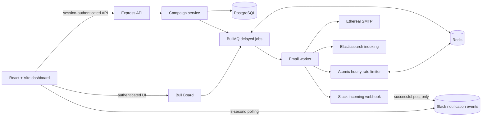

# ReachInbox Email Scheduler

ReachInbox is a full-stack email campaign scheduler. It stores campaigns in PostgreSQL, schedules recipient jobs with BullMQ/Redis, sends through Ethereal SMTP, indexes email records in Elasticsearch, and provides an authenticated React dashboard.

## Architecture



### Scheduling and worker lifecycle

```mermaid
sequenceDiagram
   participant UI as Compose UI
   participant API as Express API
   participant DB as PostgreSQL
   participant Q as BullMQ / Redis
   participant W as Email worker
   participant SMTP as Ethereal SMTP

   UI->>API: POST /api/campaigns
   API->>DB: Create Campaign + PENDING EmailJobs
   API->>Q: Add delayed job (jobId = EmailJob.id)
   Q-->>W: Activate when scheduled
   W->>DB: Atomic PENDING → PROCESSING claim
   W->>W: Check per-sender UTC hourly limit
   alt Rate limit reached
      W->>DB: Keep PENDING and move scheduledAt
      W->>Q: Move job to delayed
   else Allowed
      W->>SMTP: Send text or HTML + CID attachments
      SMTP-->>W: Accepted / preview URL
      W->>DB: Mark SENT; index for search
   end
```

### Persistence, rate limiting, and concurrency

- PostgreSQL is the source of truth for campaign and email status. BullMQ job IDs equal `EmailJob.id` for idempotent queue insertion.
- On startup, `reconcilePendingJobs` finds pending rows and ensures their BullMQ entries exist. PostgreSQL, Redis, and Elasticsearch use Docker named volumes for local persistence.
- The worker atomically claims `PENDING → PROCESSING`. Transient send failures return the row to `PENDING` until BullMQ attempts are exhausted; the final failure is recorded as `FAILED`.
- `EMAIL_WORKER_CONCURRENCY` controls worker parallelism (default: `5`). PostgreSQL conditional updates prevent multiple workers from claiming the same pending row.
- Campaign `delayBetweenEmails` is measured in seconds. Rate limiting uses atomic Redis Lua counters per sender and UTC hour. Jobs over the limit are deferred, not dropped; scheduling preserves campaign order and spacing.
- On the first rate-limit hit per sender/hour, the worker posts to Slack if connected. A persistent in-app event is written only after a successful Slack HTTP response; Redis deduplication prevents repeat webhook posts in the same hour.
- Sent and failed jobs are indexed in Elasticsearch. Slack and Elasticsearch failures do not roll back email state transitions.

## Features

| Area                        | Implemented features                                                                                                 |
| --------------------------- | -------------------------------------------------------------------------------------------------------------------- |
| Backend: scheduler          | Campaign creation, BullMQ delayed jobs, stable job IDs, worker processing, configurable concurrency                  |
| Backend: persistence        | PostgreSQL campaigns/email jobs, startup reconciliation, Redis-backed BullMQ and session store                       |
| Backend: rate limiting      | Atomic per-sender UTC-hour Redis counters, safe deferred scheduling, Slack success events                            |
| Backend: email              | Ethereal SMTP, plain-text fallback, HTML mail, bounded inline image CID attachments, preview URLs                    |
| Backend: search/operations  | Elasticsearch indexing/search, authenticated Bull Board, Google and Slack OAuth                                      |
| Frontend: account           | Google login/logout, Slack connection state and disconnect/reconnect controls                                        |
| Frontend: campaign workflow | Recipient entry and CSV/TXT upload, TipTap formatting, inline images, send time, delay, hourly limit                 |
| Frontend: email dashboard   | Scheduled, sent and failed email lists; search and status filters                                                    |
| Frontend: notifications     | Authenticated Slack-event polling, acknowledgement, toast, optional sound and valid Slack destination when available |

## Requirements

- Node.js 20.19+ (or a current Node.js 22 release) and npm
- Docker with the Compose plugin
- Google OAuth client credentials for browser login
- Ethereal SMTP account for test email delivery
- Slack app credentials for Slack notifications (optional)

## Local Setup

### 1. Start PostgreSQL, Redis, and Elasticsearch

From the repository root:

```bash
docker compose up -d
```

The Compose file exposes PostgreSQL on `5432`, Redis on `6379`, and Elasticsearch on `9200`. Local database defaults are in `docker-compose.yml`; change them there and update `DATABASE_URL` in the backend environment together if you change credentials.

### 2. Configure the backend

Copy `backend/.env.example` to `backend/.env`, then fill in local credentials. Keep `.env` private; it is ignored by Git.

```bash
cd backend
npm install
npx prisma generate
npx prisma migrate deploy
npm run dev
```

Backend URLs:

- API and health: `http://localhost:4000`
- Health check: `http://localhost:4000/health`
- Bull Board: `http://localhost:4000/admin/queues/` (requires login)

Useful checks:

```bash
npm run typecheck
npm run build
npx prisma validate
```

The backend package uses TypeScript 5.x, matching the compiler declared in `backend/package.json`.

### 3. Configure and run the frontend

Copy `frontend/.env.example` to `frontend/.env`. The default Vite proxy forwards `/api`, `/auth`, and `/admin` to the backend, so local development normally needs no additional API URL.

```bash
cd frontend
npm install
npm run dev
```

Open `http://localhost:5173`. Production frontend check:

```bash
npm run build
```

## Deploy a Free Preview to Render

The repository includes a `render.yaml` Blueprint for a Render static site, a Node web service running Express and the BullMQ worker, Free PostgreSQL, and Free Key Value (Redis). **This is only a UI/API preview, not a reliable email scheduler deployment.**

Render Free limitations that affect this application:

- The backend sleeps after 15 minutes without inbound traffic, so its worker is not continuously running.
- Free Key Value has no persistence; a restart loses BullMQ jobs and sessions.
- Free PostgreSQL expires after 30 days and has no backups.
- Free web services cannot send outbound SMTP on port 587, so Ethereal email delivery will fail.
- Elasticsearch is not included in the Blueprint. Search requires an external Elasticsearch endpoint and API key.
- Render may still request payment verification during signup. Do not enter card details if you do not want to provide them.

Use this option to preview the interface and API only. For reliable scheduling after restarts, use local Docker or paid persistent services.

### Deploy steps

1. Push the repository to GitHub. The Blueprint is configured for the `main` branch.
2. In Render, choose **New → Blueprint**, connect the repository, and select `render.yaml`.
3. Confirm each service uses the **Free** plan before provisioning.
4. Provide `GOOGLE_CLIENT_ID`, `GOOGLE_CLIENT_SECRET`, and `GOOGLE_CALLBACK_URL` when prompted. Do not add local `.env` files to Git.
5. After Render assigns the service URLs, set the Google authorized origin to the frontend URL and set the redirect URI and `GOOGLE_CALLBACK_URL` to:

   `https://<api-service>.onrender.com/auth/google/callback`

6. Redeploy the API, then check `https://<api-service>.onrender.com/health` and open the frontend URL.

The Blueprint runs `prisma migrate deploy` before starting the API and binds to Render's injected `PORT`. Its Redis/Database are Free resources, so do not rely on this deployment for durable scheduled jobs or real email delivery.

## External Services

### Google OAuth

Create a **Web application** OAuth client in [Google Cloud Console](https://console.cloud.google.com/apis/credentials).

- Authorized JavaScript origin: `http://localhost:5173`
- Authorized redirect URI: `http://localhost:4000/auth/google/callback`
- Set `GOOGLE_CLIENT_ID`, `GOOGLE_CLIENT_SECRET`, and `GOOGLE_CALLBACK_URL` in `backend/.env`.
- Set a long random `SESSION_SECRET` in `backend/.env`. Never put server secrets in `frontend/.env`.

Local sessions use an HTTP-only, `SameSite=Lax` cookie. For production HTTPS, set `NODE_ENV=production`; behind a TLS-terminating proxy, also set `TRUST_PROXY=1`.

### Ethereal Email

1. Create a test mailbox at [ethereal.email](https://ethereal.email).
2. Copy its SMTP host, port, username, and password into `ETHEREAL_HOST`, `ETHEREAL_PORT`, `ETHEREAL_USER`, and `ETHEREAL_PASSWORD` in `backend/.env`.
3. Restart the backend after changing credentials. Compose refreshes the saved sender configuration before creating a campaign.
4. Ethereal captures test mail; it does not deliver to real recipients. The worker logs an Ethereal preview URL after a successful send.

Rich-text images are embedded locally as data URLs in the campaign body, limited to 2 MB total per email, then converted to CID attachments at send time. Supported formats are PNG, JPEG, GIF, and WebP. No external image-hosting service is used.

### Slack

1. Create a Slack app at [api.slack.com/apps](https://api.slack.com/apps).
2. Enable Incoming Webhooks and configure the `incoming-webhook` OAuth scope.
3. Add redirect URL `http://localhost:4000/auth/slack/callback`.
4. Set `SLACK_CLIENT_ID`, `SLACK_CLIENT_SECRET`, and `SLACK_CALLBACK_URL` in `backend/.env`.
5. Sign in, connect Slack, and select a channel. Disconnect/reconnect remains available in the sidebar.

The in-app notification appears only after Slack accepts the webhook. It is polled every 8 seconds and acknowledged to prevent repeats. A channel link is shown only when the OAuth connection contains team and channel IDs; reconnect Slack if an older connection has no IDs.

## API Routes

| Method | Route                                  | Purpose                              |
| ------ | -------------------------------------- | ------------------------------------ |
| `GET`  | `/auth/google`                         | Start Google sign-in                 |
| `POST` | `/auth/logout`                         | End the session                      |
| `GET`  | `/auth/slack`                          | Start Slack connection               |
| `POST` | `/auth/slack/disconnect`               | Disconnect Slack                     |
| `POST` | `/api/campaigns`                       | Create a campaign and recipient jobs |
| `GET`  | `/api/emails/scheduled`                | List scheduled emails                |
| `GET`  | `/api/emails/sent`                     | List sent and failed emails          |
| `GET`  | `/api/emails/search`                   | Search email records                 |
| `GET`  | `/api/notifications/slack`             | Poll unread Slack-success events     |
| `POST` | `/api/notifications/slack/acknowledge` | Acknowledge displayed events         |
| `GET`  | `/admin/queues/`                       | Authenticated Bull Board UI          |

## Data and Security Notes

- SMTP configuration and OAuth tokens stay server-side; they are not returned to the frontend or indexed in Elasticsearch.
- Slack notification rows contain user ID, event type, title/message, timestamps, and acknowledgement state only. Slack team/channel IDs are stored separately for validated navigation links.
- Ethereal is for testing. Configure a production SMTP provider and secure production infrastructure before real delivery.
- PostgreSQL and Redis persistence in local development relies on the named Docker volumes in `docker-compose.yml`.
